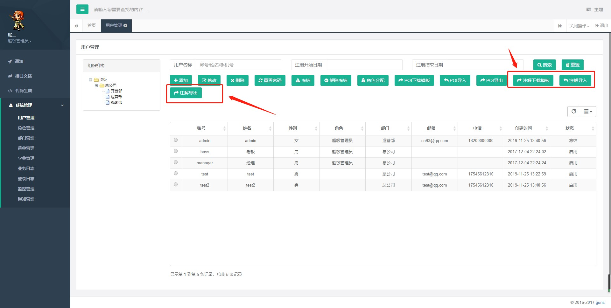

# 简介

具体参考https://github.com/wangliu1102/wl-guns中的用户管理模块的注解导入、导出功能

工具包在com.wl.guns.core.util.annotationexcel路径下



注解导入导出，通过给实体类标注注解的方式，来规定导入导出的字段，注解可自定义。

通过解析注解将查询的数据导出到excel中，或者读取excel中的数据根据注解导入进数据库。

需要引入依赖包

 

```
        <dependency>
            <groupId>org.apache.poi</groupId>
            <artifactId>poi-ooxml</artifactId>
            <version>3.17</version>
        </dependency>
```

# 工具类代码

参考com.wl.guns.core.util.annotationexcel路径下的

Excel工具方法：
`ExcelUtil`

注解：

```
Excel
Excels
```


# 导入/导出例子

结合用户管理，导入/导出用户信息

## ① 首先要给User实体类添加注解

 

```
package com.wl.guns.modular.system.model;

import com.baomidou.mybatisplus.activerecord.Model;
import com.baomidou.mybatisplus.annotations.TableField;
import com.baomidou.mybatisplus.annotations.TableId;
import com.baomidou.mybatisplus.annotations.TableName;
import com.baomidou.mybatisplus.enums.IdType;
import com.wl.guns.core.util.annotationexcel.Excel;
import com.wl.guns.core.util.annotationexcel.Excels;
import lombok.Data;

import java.io.Serializable;
import java.util.Date;

/**
 * <p>
 * 管理员表
 * </p>
 *
 * @author 王柳
 * @since 2017-07-11
 */
@TableName("sys_user")
@Data
public class User extends Model<User> {

    private static final long serialVersionUID = 1L;

    /**
     * 主键id
     */
    @Excel(name = "用户序号", cellType = Excel.ColumnType.NUMERIC, prompt = "用户编号")
    @TableId(value = "id", type = IdType.AUTO)
    private Integer id;
    /**
     * 头像
     */
    private String avatar;
    /**
     * 账号
     */
    @Excel(name = "账号")
    private String account;
    /**
     * 密码
     */
    private String password;
    /**
     * md5密码盐
     */
    private String salt;
    /**
     * 名字
     */
    @Excel(name = "用户名称")
    private String name;
    /**
     * 生日
     */
    @Excel(name = "生日", width = 30, dateFormat = "yyyy-MM-dd HH:mm:ss")
    private Date birthday;
    /**
     * 性别（1：男 2：女）
     */
    @Excel(name = "用户性别", readConverterExp = "1=男,2=女,3=未知")
    private Integer sex;
    /**
     * 电子邮件
     */
    @Excel(name = "用户邮箱")
    private String email;
    /**
     * 电话
     */
    @Excel(name = "手机号码")
    private String phone;
    /**
     * 角色id
     */
    private String roleid;
    /**
     * 部门id
     */
    @Excel(name = "部门编号", type = Excel.Type.IMPORT)
    private Integer deptid;
    /**
     * 状态(1：启用  2：冻结  3：删除）
     */
    @Excel(name = "帐号状态", readConverterExp = "1=启用,2=冻结,3=删除")
    private Integer status;
    /**
     * 创建时间
     */
    @Excel(name = "创建时间", width = 30, dateFormat = "yyyy-MM-dd HH:mm:ss", type = Excel.Type.EXPORT)
    private Date createtime;
    /**
     * 保留字段
     */
    private Integer version;

    /**
     * 部门对象, @TableField(exist = false):不在数据表中的字段
     */
    @Excels({
            @Excel(name = "部门全称", targetAttr = "fullname", type = Excel.Type.EXPORT),
            @Excel(name = "部门简称", targetAttr = "simplename", type = Excel.Type.EXPORT)
    })
    @TableField(exist = false)
    private Dept dept;

    @TableField(exist = false)
    private String beginTime;

    @TableField(exist = false)
    private String endTime;

    @Override
    protected Serializable pkVal() {
        return this.id;
    }
}
```

## ② 导出

先根据条件查询出所有要导出的数据，然后调用ExcelUtil的方法将数据写入Excel工作簿中，并存入本地文件夹。若写入Excel无错误，调用浏览器文件下载的方法（在FileDownloadController中），进行文件下载。

 

```
/**
 * 注解导出
 */
MgrUser.exportAnnotation = function () {
    var selected = $('#' + this.id).bootstrapTable('getData');
    if (selected == null || selected == "" || selected.length == 0) {
        layer.alert("数据为空，无法导出！");
        return false;
    }

    var user = {
        beginTime: $("#beginTime").val().trim(),
        endTime: $("#endTime").val().trim(),
        name: $("#name").val().trim()
    }

    Feng.confirm("确定要导出查询的数据吗？", function () {
        var index = layer.load(0, {shade: [0.3, '#f5f5f5']}); //0代表加载的风格，支持0-2
        $.ajax({
            url: Feng.ctxPath + "/mgr/exportAnnotation",
            type: "POST",
            dataType: "json",
            data: JSON.stringify(user), // 注意这里，传递对象给后台，这里必须将对象进行序列化
            contentType: 'application/json', // 注意这里，传递对象给后台，这里必须是 application/json
            success: function (data) {
                if (data.code == 200) {
                    window.location.href = Feng.ctxPath + "/common/download?fileName=" + encodeURI(data.data) + "&delete=" + true;
                } else {
                    layer.alert("导出失败!" + data.message + "!");
                }
                layer.close(index);
            },
            error: function (e) {
                layer.alert("导出失败!" + data.responseJSON.message + "!");
                layer.close(index);
            }
        });

    });
};
```

 

```
/**
     * @description 注解导出
     * @author 王柳
     * @date 2019/11/25 10:22
     * @params [user]
     */
    @RequestMapping("/exportAnnotation")
    @ResponseBody
    public Object exportAnnotation(@RequestBody User user) {
        List<User> list = userService.selectUserList(user);
        ExcelUtil<User> util = new ExcelUtil<User>(User.class);
        return util.exportExcel(list, "用户数据");
    }
```

 

```
@Controller
public class FileDownloadController {
    private static final Logger log = LoggerFactory.getLogger(FileDownloadController.class);

    @Autowired
    private GunsProperties gunsProperties;

    /**
     * 通用下载请求
     *
     * @param fileName 文件名称
     * @param delete   是否删除
     */
    @GetMapping("/common/download")
    public void fileDownload(String fileName, Boolean delete, HttpServletResponse response, HttpServletRequest request) {
        try {
            if (!FileUtils.isValidFilename(fileName)) {
                throw new Exception(StringUtils.format("文件名称({})非法，不允许下载。 ", fileName));
            }
            String realFileName = System.currentTimeMillis() + fileName.substring(fileName.indexOf("_") + 1);
            String filePath = gunsProperties.getFileUploadMapping() + fileName;

            response.setCharacterEncoding("utf-8");
            response.setContentType("multipart/form-data");
            response.setHeader("Content-Disposition", "attachment;fileName=" + FileUtils.setFileDownloadHeader(request, realFileName));
            FileUtils.writeBytes(filePath, response.getOutputStream());
            if (delete) {
                FileUtils.deleteFile(filePath);
            }
        } catch (Exception e) {
            log.error("下载文件失败", e);
        }
    }
}
```

## ③导入

首先需要下载导入模板，填入数据。调用ExcelUtil的方法解析Excel中的数据，将每行数据解析为对象，进行批量导入。

这里从前台传入了一个是否更新已存在的数据的布尔型参数。方便更新或插入已存在的数据。

 

```
@layout("/common/_container.html"){
<div class="ibox float-e-margins">
    <form method="POST">
        <div class="ibox-content">
            <div class="form-horizontal">

                <div class="row">
                    <div class="col-sm-12">
                        <input type="checkbox" id="updateSupport" name="updateSupport" title="如果登录账户已经存在，更新这条数据。"> 是否更新已经存在的用户数据
                        &nbsp;  <input type="file" id="upfile" name="upfile" placeholder="选择需要导入的文件"/>
                    </div>
                </div>
                <div class="row btn-group-m-t">
                    <div class="col-sm-10">
                        <#button btnCss="info" name="提交" id="ensure" icon="fa-check" clickFun="UserInfoDlg.importAnnotation()"/>
                        <#button btnCss="danger" name="取消" id="cancel" icon="fa-eraser" clickFun="UserInfoDlg.close()"/>
                    </div>
                </div>

            </div>
        </div>
    </form>
</div>

<script src="${ctxPath}/static/modular/system/user/user_info.js"></script>

@}

```

 

```
/**
 * 注解导入
 */
UserInfoDlg.importAnnotation = function () {
    var formData = new FormData();
    var name = $("#upfile").val();
    formData.append("file", $("#upfile")[0].files[0]);
    formData.append("updateSupport", $("input[name='updateSupport']").is(':checked'));
    var suffix = name.substr(name.lastIndexOf('.') + 1);
    if (suffix !== "xlsx" && suffix !== "xls") {
        layer.alert("请选择后缀为 “xls”或“xlsx”的文件。");
        return false;
    }
    var index = layer.load(0, {shade: [0.3, '#f5f5f5']}); //0代表加载的风格，支持0-2
    $.ajax({
        url: Feng.ctxPath + "/mgr/importAnnotation",
        type: 'POST',
        async: true,
        data: formData,
        // 告诉jQuery不要去处理发送的数据
        processData: false,
        // 告诉jQuery不要去设置Content-Type请求头
        contentType: false,
        success: function (data) {
            layer.close(index);
            if (data.code == 200) {
                window.parent.MgrUser.table.refresh();
                UserInfoDlg.close();
                Feng.alert("导入成功！" + data.message + "!");
            } else {
                layer.alert("导入失败!" + data.message + "!");
            }
        },
        error: function (data) {
            layer.close(index);
            layer.alert("导入失败!" + data.responseJSON.message + "!");
        }
    });
}
```

 

```
 /**
     * @description 注解下载模板
     * @author 王柳
     * @date 2019/11/25 11:36
     * @params []
     */
    @RequestMapping("/downloadTemplateAnnotation")
    @ResponseBody
    public Object downloadTemplateAnnotation() {
        ExcelUtil<User> util = new ExcelUtil<User>(User.class);
        return util.importTemplateExcel("用户数据");
    }

    /**
     * 跳转到注解导入页面
     */
    @RequestMapping("/importAnnotationExcel")
    public String importAnnotationExcel() {
        return PREFIX + "user_import_annotation_excel.html";
    }

    /**
     * @description 注解导入
     * @author 王柳
     * @date 2019/11/25 11:56
     * @params [file, updateSupport]
     */
    @RequestMapping("/importAnnotation")
    @ResponseBody
    public Object importAnnotation(MultipartFile file, boolean updateSupport) throws Exception {
        ExcelUtil<User> util = new ExcelUtil<User>(User.class);
        List<User> userList = util.importExcel(file.getInputStream());
        ResponseData responseData = userService.importUser(userList, updateSupport);
        if (ResponseData.DEFAULT_SUCCESS_CODE.equals(responseData.getCode())) {
            Map map = (Map) responseData.getData();
            List<User> newUserList = (List<User>) map.get("new");
            List<User> oldUserList = (List<User>) map.get("old");
            if (newUserList.size() != 0) {
                userService.insertBatch(newUserList);
            }
            if (oldUserList.size() != 0) {
                userService.updateBatchById(oldUserList);
            }
        }
        return responseData;
    }
```

 

```
    @Override
    public ResponseData importUser(List<User> userList, boolean updateSupport) {
        if (StringUtils.isNull(userList) || userList.size() == 0) {
            throw new ServiceException(BizExceptionEnum.IMPORT_EXCEL_NULL);
        }
        int successNum = 0;
        int failureNum = 0;
        StringBuilder successMsg = new StringBuilder();
        StringBuilder failureMsg = new StringBuilder();
        List<User> newUserList = new ArrayList<>();
        List<User> updateUserList = new ArrayList<>();
        for (User user : userList) {
            try {
                // 验证是否存在这个用户
                User u = baseMapper.getByAccount(user.getAccount());
                if (StringUtils.isNull(u)) {
                    user.setCreatetime(new Date());
                    newUserList.add(user);
                    successNum++;
                    successMsg.append("<br/>" + successNum + "、账号 " + user.getAccount() + " 导入成功");
                } else if (updateSupport) {
                    // 已存在的用户,要做更新
                    user.setId(u.getId());
                    user.setCreatetime(new Date());
                    updateUserList.add(user);
                    successNum++;
                    successMsg.append("<br/>" + successNum + "、账号 " + user.getAccount() + " 更新成功");
                } else {
                    failureNum++;
                    failureMsg.append("<br/>" + failureNum + "、账号 " + user.getAccount() + " 已存在");
                }
            } catch (Exception e) {
                failureNum++;
                String msg = "<br/>" + failureNum + "、账号 " + user.getAccount() + " 导入失败：";
                failureMsg.append(msg + e.getMessage());
                log.error(msg, e);
            }
        }
        if (failureNum > 0) {
            failureMsg.insert(0, "很抱歉，导入失败！共 " + failureNum + " 条数据格式不正确，错误如下：");
            return ResponseData.error(failureMsg.toString());
        } else {
            successMsg.insert(0, "恭喜您，数据已全部导入成功！共 " + successNum + " 条，数据如下：");
        }
        Map map = new HashMap();
        map.put("new", newUserList);
        map.put("old", updateUserList);
        return ResponseData.success(200, successMsg.toString(), map);
    }
```