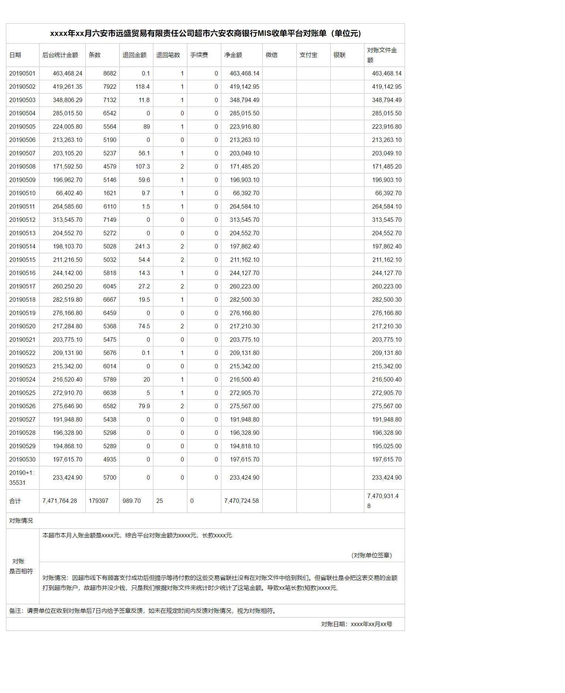

 不做具体功能，参考MIS代码，需要给对账中心设置对账单导出，对账单格式有具体要求，如下： 



具体工具类代码如下，未做优化，根据需要自定义：

 

```
package com.huishu.mis.core.util;

import org.apache.poi.ss.util.CellRangeAddress;
import org.apache.poi.xssf.usermodel.*;

import javax.servlet.http.HttpServletRequest;
import javax.servlet.http.HttpServletResponse;
import java.awt.*;
import java.io.OutputStream;
import java.text.DecimalFormat;
import java.util.List;
import java.util.Map;

/**
 * 对账单导出Excel(特殊格式自定义)
 * <p>
 * Created by 王柳
 * Date 2019/7/17 10:42
 * version:1.0
 */
public class ExportExcelStatment {

    // 导出表格的表名
    private String title;

    // 导出表格的列名
    private String[] rowName;

    // 导出表格的数据列
    private String[] dataName;

    // 导出数据的List集合
    private List<Map<String, Object>> dataList;

    private HttpServletRequest request;

    private HttpServletResponse response;


    // 传入要导入的数据
    public ExportExcelStatment(String title, String[] rowName, String[] dataName, List<Map<String, Object>> dataList, HttpServletRequest request, HttpServletResponse response) {
        this.title = title;
        this.rowName = rowName;
        this.dataName = dataName;
        this.dataList = dataList;
        this.request = request;
        this.response = response;
    }

    // 导出数据
    public void exportData() {
        try {
            // 创建一个excel对象
            XSSFWorkbook workbook = new XSSFWorkbook();
            // 创建表格
            XSSFSheet sheet = workbook.createSheet(title);
            // 表格列的长度
            int columnNum = rowName.length;
            // sheet样式定义
            // 头样式
            XSSFCellStyle columnTopStyle = this.getColumnTopStyle(workbook);
            // 单元格样式
            XSSFCellStyle style = this.getStyle(workbook, XSSFCellStyle.ALIGN_CENTER);
            XSSFCellStyle leftStyle = this.getStyle(workbook, XSSFCellStyle.ALIGN_LEFT);
            XSSFCellStyle rightStyle = this.getStyle(workbook, XSSFCellStyle.ALIGN_RIGHT);
            // 产生表格标题行
            // 1、2、3行
            // 创建行和列
            for (int i = 0; i < 3; i++) {
                XSSFRow row = sheet.createRow(i);
                for (int j = 0; j < columnNum; j++) {
                    row.createCell(j).setCellStyle(style);
                }
            }
            // 单元格
            XSSFCell cellTiltle = sheet.getRow(0).createCell(0);
            cellTiltle.setCellStyle(columnTopStyle);
            cellTiltle.setCellValue(title);
            /**
             * 参数说明
             * CellRangeAddress  对象的构造方法需要传入合并单元格的首行、最后一行、首列、最后一列。
             */
            // 合并第1、2、3行的所有列
            sheet.addMergedRegion(new CellRangeAddress(0, 2, 0, (columnNum - 1)));

            // 在第四行创建行,设置列名
            XSSFRow rowRowName = sheet.createRow(3);
            XSSFCellStyle cells = workbook.createCellStyle();
            cells.setBottomBorderColor(new XSSFColor(Color.BLACK));
            rowRowName.setRowStyle(cells);
            // 循环 将列名放进去
            for (int i = 0; i < columnNum; i++) {
                XSSFCell cellRowName = rowRowName.createCell(i);
                // 单元格类型
                cellRowName.setCellType(XSSFCell.CELL_TYPE_STRING);
                // 得到列的值
                XSSFRichTextString text = new XSSFRichTextString(rowName[i]);
                // 设置列的值
                cellRowName.setCellValue(text);
                // 样式
                cellRowName.setCellStyle(columnTopStyle);
                sheet.autoSizeColumn(i); //调整列宽度
            }

            // 将查询到的数据设置到对应的单元格中
            for (int i = 0; i < dataList.size(); i++) {
                //创建所需的行数
                XSSFRow row = sheet.createRow(i + 4);
                //遍历每个对象
                Map<String, Object> map = dataList.get(i);

                for (int j = 0; j < dataName.length; j++) {
                    //设置单元格的数据类型
                    XSSFCell cell = row.createCell(j, XSSFCell.CELL_TYPE_STRING);
                    String value = String.valueOf(map.get(dataName[j]));
                    if (ToolUtil.isEmpty(value)) {
                        cell.setCellValue("");
                    } else {
                        cell.setCellValue(value);
                    }
                    // 样式
                    cell.setCellStyle(style);
                    //  让列宽随着导出的列长自动适应
                    sheet.autoSizeColumn(j); //调整列宽度
                }
            }

            // 创建行和列
            for (int i = 4; i <= 20; i++) {
                XSSFRow row = sheet.createRow(dataList.size() + i);
                for (int j = 0; j < columnNum; j++) {
                    row.createCell(j).setCellStyle(style);
                }
            }

            // 单元格
            XSSFCell cellTiltle4 = sheet.getRow(dataList.size() + 4).getCell(0);
            cellTiltle4.setCellStyle(style);
            cellTiltle4.setCellValue("对账情况");
            // 合并行的所有列
            sheet.addMergedRegion(new CellRangeAddress(dataList.size() + 4, dataList.size() + 6, 0, (columnNum - 1)));

            // 单元格
            XSSFCell cellTiltle6 = sheet.getRow(dataList.size() + 7).getCell(0);
            cellTiltle6.setCellStyle(style);
            cellTiltle6.setCellValue("对账是否相符");
            // 合并
            sheet.addMergedRegion(new CellRangeAddress(dataList.size() + 7, dataList.size() + 16, 0, 0));

            // 单元格
            XSSFCell cellTiltle7 = sheet.getRow(dataList.size() + 7).getCell(1);
            cellTiltle7.setCellStyle(style);
            cellTiltle7.setCellValue("本超市本月入账金额是_____________元，综合平台对账金额为_____________元，长款_____________元.\n\n" +
                    "                                                                            （对账单位签章）");
            sheet.addMergedRegion(new CellRangeAddress(dataList.size() + 7, dataList.size() + 11, 1, (columnNum - 1)));

            // 单元格
            XSSFCell cellTiltle11 = sheet.getRow(dataList.size() + 12).getCell(1);
            cellTiltle11.setCellStyle(style);
            cellTiltle11.setCellValue("对账情况：因超市线下有顾客支付成功后但提示等待付款的这些交易省联社没有在对账文件中给到我们。但" +
                    "省联社是会把这表交易的金额打到超市账户，故超市并没少钱，只是我们根据对账文件来统计时少统计了这笔金额。" +
                    "导致_________笔长款(短款)_____________元");
            sheet.addMergedRegion(new CellRangeAddress(dataList.size() + 12, dataList.size() + 16, 1, (columnNum - 1)));

            // 单元格
            XSSFCell cellTiltle16 = sheet.getRow(dataList.size() + 17).getCell(0);
            cellTiltle16.setCellStyle(leftStyle);
            cellTiltle16.setCellValue("备注：请贵单位在收到对账单后7日内给予签章反馈，如未在规定时间内反馈对账情况，视为对账相符。");
            sheet.addMergedRegion(new CellRangeAddress(dataList.size() + 17, dataList.size() + 18, 0, (columnNum - 1)));

            // 单元格
            XSSFCell cellTiltle18 = sheet.getRow(dataList.size() + 19).getCell(0);
            cellTiltle18.setCellStyle(rightStyle);
            cellTiltle18.setCellValue(" 对账日期：__________年________月________号");
            sheet.addMergedRegion(new CellRangeAddress(dataList.size() + 19, dataList.size() + 20, 0, (columnNum - 1)));


            if (workbook != null) {
                response.setHeader("Content-disposition", "attachment; filename="
                        + new String((title + ".xlsx").getBytes("utf-8"), "ISO8859-1"));//设置下载的文件名

                OutputStream outputStream = null;
                try {
                    outputStream = response.getOutputStream();
                    request.getSession().removeAttribute(ExcelConstant.EXPORT_FLAG);
                    workbook.write(outputStream);
                } catch (Exception e) {
                    e.printStackTrace();
                } finally {
                    if (null != outputStream) {
                        try {
                            outputStream.close();
                        } catch (Exception e) {
                            e.printStackTrace();
                        }
                    }
                }
            }

        } catch (Exception e) {
            e.printStackTrace();
        }

    }

    public static Double replaceDouble(Object o) {
        return Double.valueOf(String.valueOf(o).replace(",", ""));
    }

    public static Integer replaceInteger(Object o) {
        return Integer.valueOf(String.valueOf(o).replace(",", ""));
    }

    /**
     * 保留两位小数，整数部分从右向左每3位一个逗号进行格式化输出
     */
    public static String formatDouble(Double d) {
        return new DecimalFormat("#,##0.00").format(d);
    }

    public XSSFCellStyle getColumnTopStyle(XSSFWorkbook workbook) {

        // 设置字体
        XSSFFont font = workbook.createFont();
        //设置字体大小
        font.setFontHeightInPoints((short) 11);
        //字体加粗
        font.setBoldweight(XSSFFont.BOLDWEIGHT_BOLD);
        //设置字体名字
        font.setFontName("Courier New");
        //设置样式;
        XSSFCellStyle style = workbook.createCellStyle();
        //设置底边框;
        style.setBorderBottom(XSSFCellStyle.BORDER_THIN);
        //设置底边框颜色;
        style.setBottomBorderColor(new XSSFColor(java.awt.Color.BLACK));
        //设置左边框;
        style.setBorderLeft(XSSFCellStyle.BORDER_THIN);
        //设置左边框颜色;
        style.setLeftBorderColor(new XSSFColor(java.awt.Color.BLACK));
        //设置右边框;
        style.setBorderRight(XSSFCellStyle.BORDER_THIN);
        //设置右边框颜色;
        style.setRightBorderColor(new XSSFColor(java.awt.Color.BLACK));
        //设置顶边框;
        style.setBorderTop(XSSFCellStyle.BORDER_THIN);
        //设置顶边框颜色;
        style.setTopBorderColor(new XSSFColor(java.awt.Color.BLACK));
        //在样式用应用设置的字体;
        style.setFont(font);
        //设置自动换行;
        style.setWrapText(true);
        //设置水平对齐的样式为居中对齐;
        style.setAlignment(XSSFCellStyle.ALIGN_CENTER);
        //设置垂直对齐的样式为居中对齐;
        style.setVerticalAlignment(XSSFCellStyle.VERTICAL_CENTER);

        return style;

    }

    public XSSFCellStyle getStyle(XSSFWorkbook workbook, short align) {
        // 设置字体
        XSSFFont font = workbook.createFont();
        //设置字体大小
        //font.setFontHeightInPoints((short)10);
        //字体加粗
        //font.setBoldweight(XSSFFont.BOLDWEIGHT_BOLD);
        //设置字体名字
        font.setFontName("Courier New");
        //设置样式;
        XSSFCellStyle style = workbook.createCellStyle();
        //设置底边框;
        style.setBorderBottom(XSSFCellStyle.BORDER_THIN);
        //设置底边框颜色;
        style.setBottomBorderColor(new XSSFColor(java.awt.Color.BLACK));
        //设置左边框;
        style.setBorderLeft(XSSFCellStyle.BORDER_THIN);
        //设置左边框颜色;
        style.setLeftBorderColor(new XSSFColor(java.awt.Color.BLACK));
        //设置右边框;
        style.setBorderRight(XSSFCellStyle.BORDER_THIN);
        //设置右边框颜色;
        style.setRightBorderColor(new XSSFColor(java.awt.Color.BLACK));
        //设置顶边框;
        style.setBorderTop(XSSFCellStyle.BORDER_THIN);
        //设置顶边框颜色;
        style.setTopBorderColor(new XSSFColor(java.awt.Color.BLACK));
        //在样式用应用设置的字体;
        style.setFont(font);
        //设置自动换行;
        style.setWrapText(true);
        //设置水平对齐的样式为居中对齐;
        style.setAlignment(align);
        //设置垂直对齐的样式为居中对齐;
        style.setVerticalAlignment(XSSFCellStyle.VERTICAL_CENTER);

        return style;
    }
}
```

调用导出方法：

```
// title:表头
String title = year + "年" + month + "月" + companyName + "六安农商银行MIS收单平台对账单（单位元)";
// rowName：列名集合
String[] rowName = {"日期", "后台统计金额", "条数", "退回金额", "退回笔数", "手续费", "净金额", "微信", "支付宝", "银联", "对账文件金额"};
// dataName:数据库查询出的列名集合
String[] dataName = {"createTime", "consumeAmount", "consumeNum", "returnAmount", "returnNum", "fee", "amt", "checkAlipayAmt",
                "checkWechatAmt", "checkUnionpayAmt", "checkAmt"};
// dayList:查询的数据
ExportExcelStatment exportExcelStatment = new ExportExcelStatment(title, rowName, dataName, dayList, request,response);
exportExcelStatment.exportData();
```

