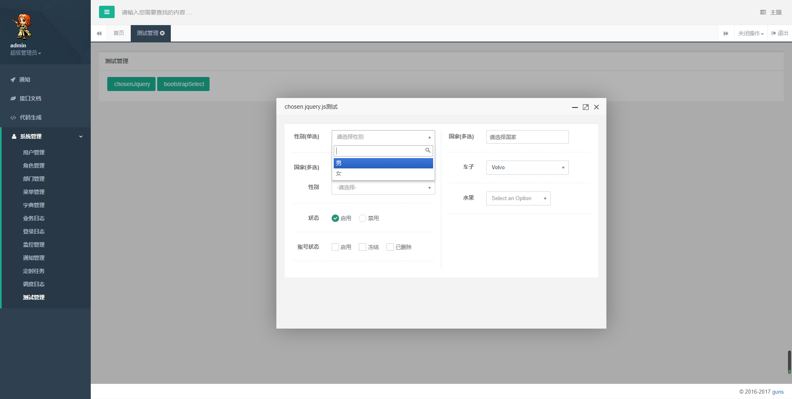
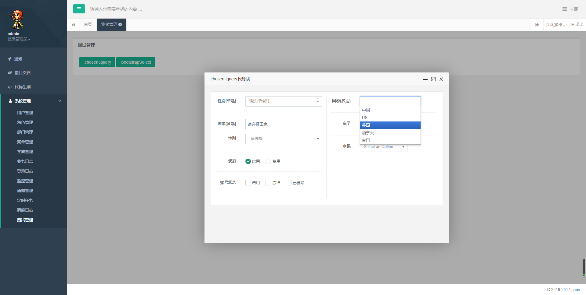

需要引入相关js和css

在https://github.com/wangliu1102/wl-guns 中: /static/js/plugins/chosen/chosen.jquery.js 和 /static/css/plugins/chosen/chosen.css

具体实现功能页面在WEB-INF/view/system/test/chosen_test.html中

**第一种方式**：

给select选择框添加class="chosen-select" tabindex="1" data-placeholder="请选择"

 

```
<select class="form-control chosen-select" id="sex1" name="sex1" tabindex="1" data-placeholder="请选择性别">
   <option value=""></option>
   <option value="1">男</option>
   <option value="2">女</option>
</select>
```



**第二种方式**：

在js初始化时设置chosen相关配置

 

```
<select class='chosen' data-placeholder='请选择国家' multiple >
    <option value=""></option>
    <option value="China">中国</option>
    <option value="US">US</option>
    <option value="England">英国</option>
    <option value="Canada">加拿大</option>
    <option value="Cube">古巴</option>
</select>
```

 

```
$(function () {
    $('.chosen').chosen({
        no_results_text: "没有找到结果！",//搜索无结果时显示的提示
        search_contains:true,   //关键字模糊搜索。设置为true，只要选项包含搜索词就会显示；设置为false，则要求从选项开头开始匹配
        allow_single_deselect:true, //单选下拉框是否允许取消选择。如果允许，选中选项会有一个x号可以删除选项
        disable_search: false, //禁用搜索。设置为true，则无法搜索选项。
        disable_search_threshold: 0, //当选项少等于于指定个数时禁用搜索。
        inherit_select_classes: true, //是否继承原下拉框的样式类，此处设为继承
        placeholder_text_single: '选择车子', //单选选择框的默认提示信息，当选项为空时会显示。如果原下拉框设置了data-placeholder，会覆盖这里的值。
        width: '200px', //设置chosen下拉框的宽度。即使原下拉框本身设置了宽度，也会被width覆盖。
        max_shown_results: 1000, //下拉框最大显示选项数量
        display_disabled_options: false,
        single_backstroke_delete: false, //false表示按两次删除键才能删除选项，true表示按一次删除键即可删除
        case_sensitive_search: false, //搜索大小写敏感。此处设为不敏感
        group_search: true, //选项组是否可搜。此处搜索不可搜
        include_group_label_in_selected: true //选中选项是否显示选项分组。false不显示，true显示。默认false。
    });
    $('.chosen2').chosen({
        search_contains:false,
        enable_split_word_search: true //分词搜索，选项词可通过空格或'[]'分隔。search_contains为false时才能看出效果
    });
});
```

