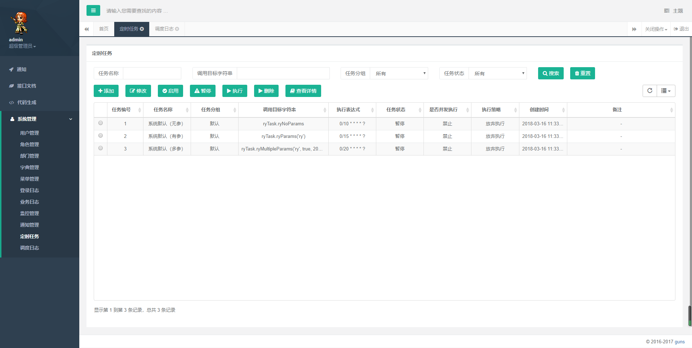
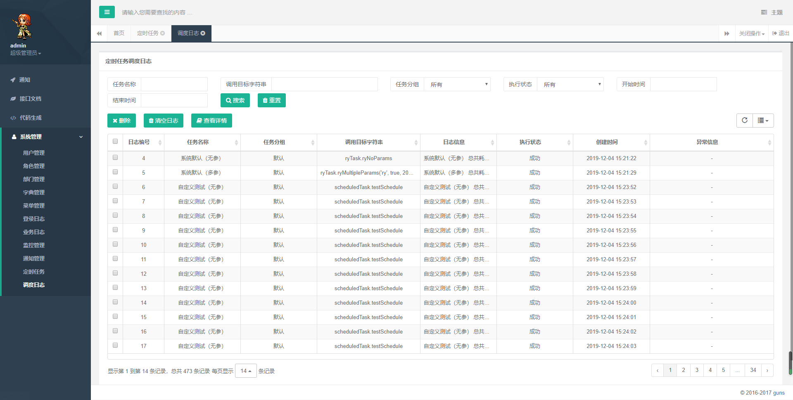

首先需要引入依赖

 

```
        <!-- 定时任务 -->
        <dependency>
            <groupId>org.quartz-scheduler</groupId>
            <artifactId>quartz</artifactId>
            <exclusions>
                <exclusion>
                    <groupId>com.mchange</groupId>
                    <artifactId>c3p0</artifactId>
                </exclusion>
            </exclusions>
        </dependency>
        <!-- hutool工具包 -->
        <dependency>
            <groupId>cn.hutool</groupId>
            <artifactId>hutool-all</artifactId>
            <version>5.0.6</version>
        </dependency>
        <!--常用工具类 -->
        <dependency>
            <groupId>org.apache.commons</groupId>
            <artifactId>commons-lang3</artifactId>
        </dependency>
```

其次需要数据库中导入相关表：

将https://github.com/wangliu1102/wl-guns 中，sql目录下的quartz.sql和sys_job放入数据库中执行即可。

**功能部分**：在com.wl.guns.modular.quartz包下实现了quartz动态定时器的功能。



