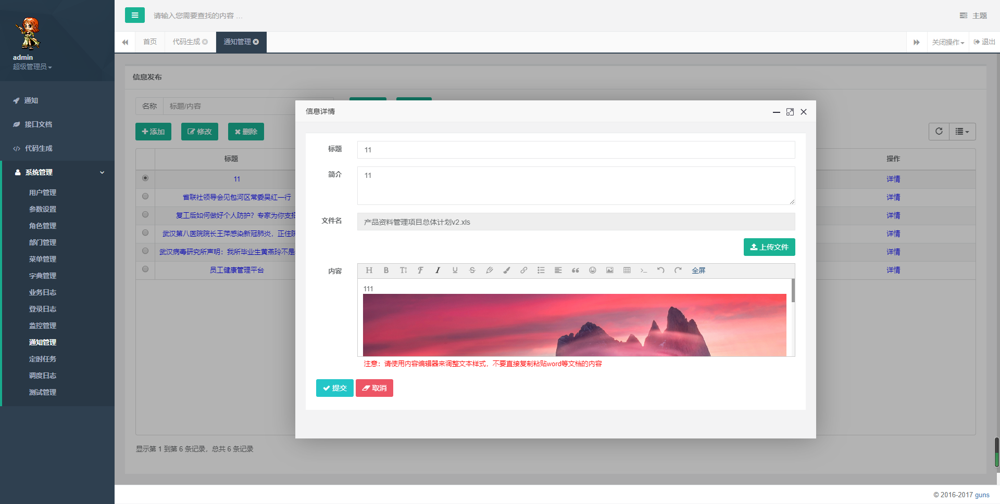
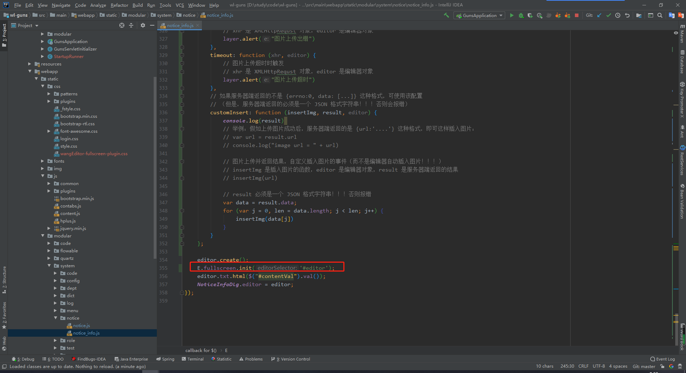
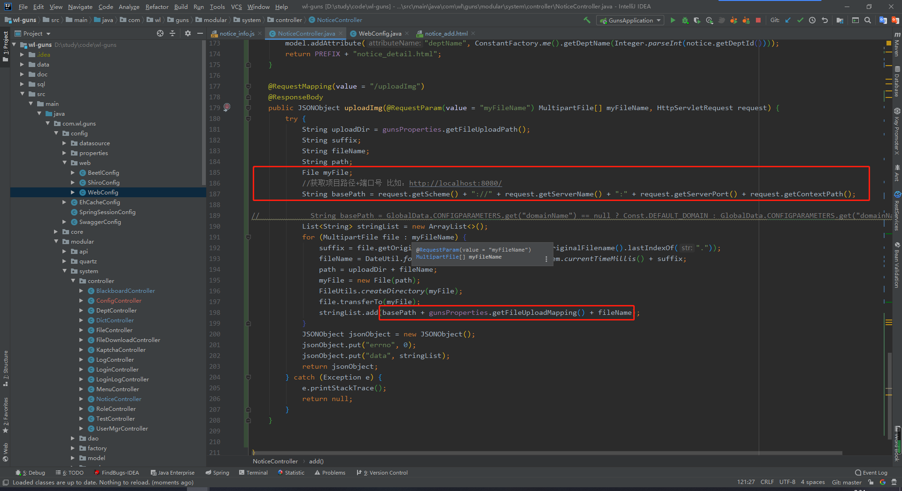
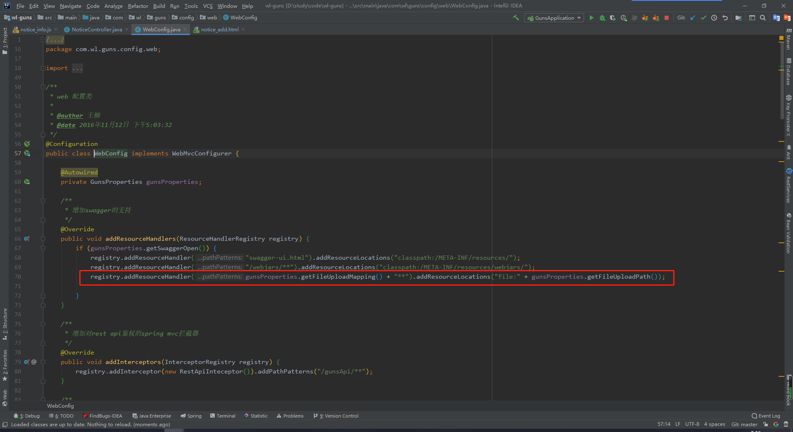

# 简介

具体参考https://github.com/wangliu1102/wl-guns 下的通知管理。

这里集成了文件上传和下载，富文本编辑器中集成了图片上传：



加入了全屏设置，需要加入如下文件：

 

```
static/js/plugins/wangEditor/wangEditor-fullscreen-plugin.js
static/css/wangEditor-fullscreen-plugin.css
```



使得图片可以回显，文件可以下载，返回路径如下。

若有远程服务器，将文件上传至服务器，可以通过域名设置路径，如下注释的bathPath。



同时设置路径映射：

