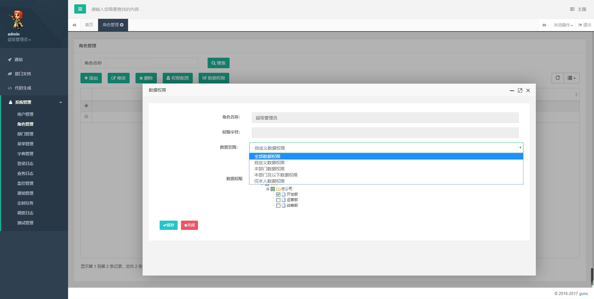
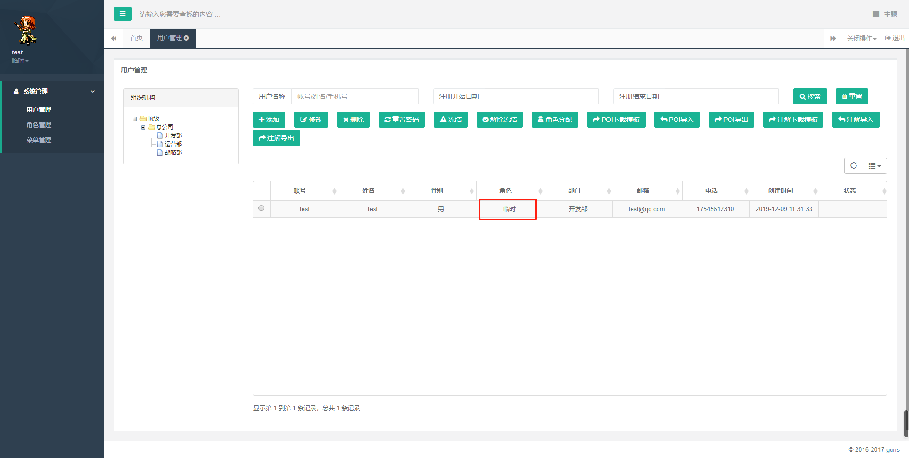

 需要新建部门-角色关联表。

 

```
CREATE TABLE `sys_role_dept` (
  `role_id` int(11) NOT NULL COMMENT '角色ID',
  `dept_id` int(11) NOT NULL COMMENT '部门ID',
  PRIMARY KEY (`role_id`,`dept_id`) USING BTREE
) ENGINE=InnoDB DEFAULT CHARSET=utf8 COMMENT='角色和部门关联表';
```

自定义数据权限，其实就是利用Spring的AOP思想，在SQL语句执行前，利用注解这个切入点将权限的SQL语句拼接到原SQL语句后面来继续执行。

这里我们分了五种数据权限：

- 1、全部数据权限（默认）
- 2、自定数据权限
- 3、部门数据权限
- 4、部门及以下数据权限
- 5、仅本人数据权限

注解类：**DataScope**

 

```
/**
 * 数据权限过滤注解
 *
 * @author 王柳
 */
@Target(ElementType.METHOD)
@Retention(RetentionPolicy.RUNTIME)
@Documented
public @interface DataScope
{
    /**
     * 部门表的别名
     */
     String deptAlias() default "d";
    /**
     * 用户表的别名
     */
     String userAlias() default "u";
}
```

AOP切面类：**DataScopeAspect**：

 

```
/**
 * 数据过滤处理
 *
 * @author 王柳
 */
@Aspect
@Component
@Slf4j
public class DataScopeAspect {
    /**
     * 全部数据权限
     */
    public static final String DATA_SCOPE_ALL = "1";
    /**
     * 自定数据权限
     */
    public static final String DATA_SCOPE_CUSTOM = "2";
    /**
     * 部门数据权限
     */
    public static final String DATA_SCOPE_DEPT = "3";
    /**
     * 部门及以下数据权限
     */
    public static final String DATA_SCOPE_DEPT_AND_CHILD = "4";
    /**
     * 仅本人数据权限
     */
    public static final String DATA_SCOPE_SELF = "5";
    /**
     * 数据权限过滤关键字
     */
    public static final String DATA_SCOPE = "dataScope";
    /**
     * 配置织入点
     */
    @Pointcut("@annotation(com.wl.guns.core.common.annotion.DataScope)")
    public void dataScopePointCut() {
    }
    @Before("dataScopePointCut()")
    public void doBefore(JoinPoint point) throws Throwable {
        handleDataScope(point);
    }
    protected void handleDataScope(final JoinPoint joinPoint) {
        // 获得注解
        DataScope controllerDataScope = getAnnotationLog(joinPoint);
        if (controllerDataScope == null) {
            return;
        }
        // 获取当前的用户
        ShiroUser currentUser = ShiroKit.getUser();
        if (currentUser != null) {
            // 如果是超级管理员，则不过滤数据
            if (!ShiroKit.isAdmin()) {
                dataScopeFilter(joinPoint, currentUser, controllerDataScope.deptAlias(),
                        controllerDataScope.userAlias());
            }
        }
    }
    /**
     * 数据范围过滤
     *
     * @param joinPoint 切点
     * @param user      用户
     * @param deptAlias 别名
     * @param userAlias 别名
     */
    public static void dataScopeFilter(JoinPoint joinPoint, ShiroUser user, String deptAlias, String userAlias) {
        StringBuilder sqlString = new StringBuilder();
        for (Integer roleId : user.getRoleList()) {
            Role role = new Role().selectById(roleId);
            String dataScope = role.getDataScope();
            //全部数据权限
            if (DATA_SCOPE_ALL.equals(dataScope)) {
                sqlString = new StringBuilder();
                break;
                //自定数据权限
            } else if (DATA_SCOPE_CUSTOM.equals(dataScope)) {
                sqlString.append(StrUtil.format(
                        " OR {}.id IN ( SELECT dept_id FROM sys_role_dept WHERE role_id = {} ) ", deptAlias,
                        role.getId()));
                //部门数据权限
            } else if (DATA_SCOPE_DEPT.equals(dataScope)) {
                sqlString.append(StrUtil.format(" OR {}.id = {} ", deptAlias, user.getDeptId()));
                //部门及以下数据权限
            } else if (DATA_SCOPE_DEPT_AND_CHILD.equals(dataScope)) {
                Dept dept = new Dept().selectById(user.getDeptId());
                String pids = ObjectUtil.isNull(dept) ? "" : dept.getPids();
                String deptChild = pids + "[" + user.getDeptId() + "],";
                sqlString.append(StrUtil.format(
                        " OR {}.id IN ( SELECT id FROM sys_dept WHERE id = {} or pids LIKE '%{}%' )",
                        deptAlias, user.getDeptId(), deptChild));
                // 仅本人数据权限
            } else if (DATA_SCOPE_SELF.equals(dataScope)) {
                if (StrUtil.isNotBlank(userAlias)) {
                    sqlString.append(StrUtil.format(" OR {}.id = {} ", userAlias, user.getId()));
                } else {
                    // 数据权限为仅本人且没有userAlias别名不查询任何数据
                    log.info("仅本人数据权限没有获取到本人id");
                    sqlString.append(" OR 1=0 ");
                }
            }
        }
        if (StringUtils.isNotBlank(sqlString.toString())) {
            BaseModel baseEntity = (BaseModel) joinPoint.getArgs()[0];
            baseEntity.getParams().put(DATA_SCOPE, " AND (" + sqlString.substring(4) + ")");
        }
    }
    /**
     * 是否存在注解，如果存在就获取
     */
    private DataScope getAnnotationLog(JoinPoint joinPoint) {
        Signature signature = joinPoint.getSignature();
        MethodSignature methodSignature = (MethodSignature) signature;
        Method method = methodSignature.getMethod();
        if (method != null) {
            return method.getAnnotation(DataScope.class);
        }
        return null;
    }
}
```

使用的话，就是在service层，在需要自定义权限的方法加上@**DataScope**注解即可

 

```
    @Override
    @DataScope(deptAlias = "d", userAlias = "u")
    public List<Map<String, Object>> selectUsers(User user) {
        return this.baseMapper.selectUsers(user);
    }
```

具体实现参考https://github.com/wangliu1102/wl-guns 中角色管理的数据权限配置



使用admin登录，去用户管理查看用户列表，可以看到所有用户，因为admin为超级管理员用户。

新建test用户，给它分配临时角色，临时角色的数据权限配置为：仅本人数据权限。

再用test用户登录，去用户管理只能看到自己一条记录。

