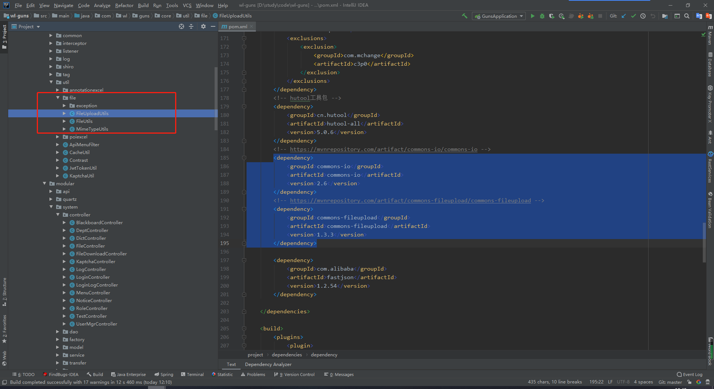
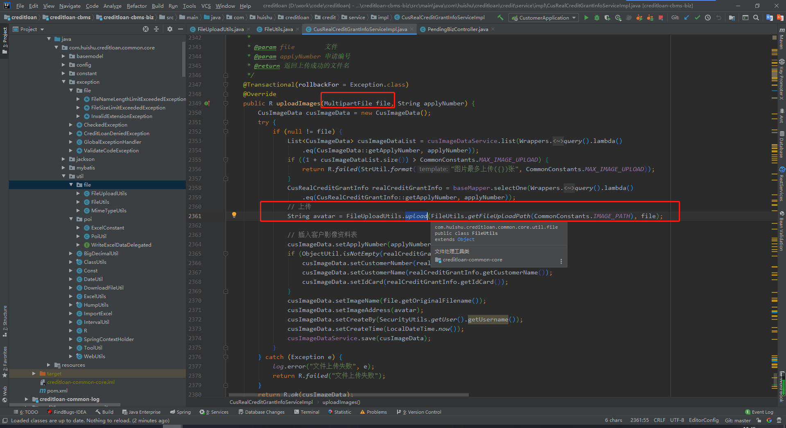

# 简介

具体参考https://github.com/wangliu1102/wl-guns，

工具包在com.wl.guns.core.util.file路径下



## creditloan、employeehealth中的通知管理都包含了文件上传和下载；

需要引入依赖包

 

```
        <!-- https://mvnrepository.com/artifact/commons-io/commons-io -->
        <dependency>
            <groupId>commons-io</groupId>
            <artifactId>commons-io</artifactId>
            <version>2.6</version>
        </dependency>
        <!-- https://mvnrepository.com/artifact/commons-fileupload/commons-fileupload -->
        <dependency>
            <groupId>commons-fileupload</groupId>
            <artifactId>commons-fileupload</artifactId>
            <version>1.3.3</version>
        </dependency>
```

工具类方法：

 

```
package com.huishu.creditloan.common.core.util.file;

import cn.hutool.core.date.DateUtil;
import cn.hutool.core.util.StrUtil;
import cn.hutool.crypto.SecureUtil;
import com.huishu.creditloan.common.core.exception.file.FileNameLengthLimitExceededException;
import com.huishu.creditloan.common.core.exception.file.FileSizeLimitExceededException;
import com.huishu.creditloan.common.core.exception.file.InvalidExtensionException;
import org.apache.commons.io.FilenameUtils;
import org.springframework.web.multipart.MultipartFile;

import java.io.File;
import java.io.IOException;
import java.util.Date;

/**
 * 文件上传工具类
 *
 * @author 王柳
 */
public class FileUploadUtils {
    /**
     * 默认大小 50M
     */
    public static final long DEFAULT_MAX_SIZE = 50 * 1024 * 1024;

    /**
     * 默认的文件名最大长度 100
     */
    public static final int DEFAULT_FILE_NAME_LENGTH = 100;

    /**
     * 默认上传的地址
     */
    private static String defaultBaseDir = FileUtils.getFileUploadPath("");

    private static int counter = 0;

    public static void setDefaultBaseDir(String defaultBaseDir) {
        FileUploadUtils.defaultBaseDir = defaultBaseDir;
    }

    public static String getDefaultBaseDir() {
        return defaultBaseDir;
    }

    /**
     * 以默认配置进行文件上传
     *
     * @param file 上传的文件
     * @return 文件名称
     * @throws Exception
     */
    public static final String upload(MultipartFile file) throws IOException {
        try {
            return upload(getDefaultBaseDir(), file, MimeTypeUtils.DEFAULT_ALLOWED_EXTENSION);
        } catch (Exception e) {
            throw new IOException(e.getMessage(), e);
        }
    }

    /**
     * 根据文件路径上传
     *
     * @param baseDir 相对应用的基目录
     * @param file    上传的文件
     * @return 文件名称
     * @throws IOException
     */
    public static final String upload(String baseDir, MultipartFile file) throws IOException {
        try {
            return upload(baseDir, file, MimeTypeUtils.DEFAULT_ALLOWED_EXTENSION);
        } catch (Exception e) {
            throw new IOException(e.getMessage(), e);
        }
    }

    /**
     * 文件上传
     *
     * @param baseDir          相对应用的基目录
     * @param file             上传的文件
     * @param allowedExtension 上传文件类型
     * @return 返回上传成功的文件名
     * @throws FileSizeLimitExceededException       如果超出最大大小
     * @throws FileNameLengthLimitExceededException 文件名太长
     * @throws IOException                          比如读写文件出错时
     * @throws InvalidExtensionException            文件校验异常
     */
    public static final String upload(String baseDir, MultipartFile file, String[] allowedExtension)
        throws FileSizeLimitExceededException, IOException, FileNameLengthLimitExceededException,
        InvalidExtensionException {
        int fileNamelength = file.getOriginalFilename().length();
        if (fileNamelength > FileUploadUtils.DEFAULT_FILE_NAME_LENGTH) {
            throw new FileNameLengthLimitExceededException("upload.filename.exceed.length: " + FileUploadUtils.DEFAULT_FILE_NAME_LENGTH);
        }

        assertAllowed(file, allowedExtension);

        String fileName = extractFilename(file);

        File desc = getAbsoluteFile(baseDir, fileName);
        file.transferTo(desc);
        String pathFileName = getPathFileName(baseDir, fileName);
        return pathFileName;
    }

    /**
     * 编码文件名
     */
    public static final String extractFilename(MultipartFile file) {
        String fileName = file.getOriginalFilename();
        String extension = getExtension(file);
        fileName = DateUtil.format(new Date(), "yyyy/MM/dd") + "/" + encodingFilename(fileName) + "." + extension;
        return fileName;
    }

    private static final File getAbsoluteFile(String uploadDir, String fileName) throws IOException {
        File desc = new File(uploadDir + File.separator + fileName);

        if (!desc.getParentFile().exists()) {
            desc.getParentFile().mkdirs();
        }
        return desc;
    }

    private static final String getPathFileName(String uploadDir, String fileName) throws IOException {
        int dirLastIndex = FileUtils.getFileUploadPath("").length();
        String currentDir = StrUtil.subSuf(uploadDir, dirLastIndex);
        String pathFileName = currentDir + fileName;
        return pathFileName;
    }

    /**
     * 编码文件名
     */
    private static final String encodingFilename(String fileName) {
        fileName = fileName.replace("_", " ");
        fileName = SecureUtil.md5(fileName + System.nanoTime() + counter++);
        return fileName;
    }

    /**
     * 文件大小校验
     *
     * @param file 上传的文件
     * @return
     * @throws FileSizeLimitExceededException 如果超出最大大小
     * @throws InvalidExtensionException
     */
    public static final void assertAllowed(MultipartFile file, String[] allowedExtension)
        throws FileSizeLimitExceededException, InvalidExtensionException {
        long size = file.getSize();
        if (DEFAULT_MAX_SIZE != -1 && size > DEFAULT_MAX_SIZE) {
            throw new FileSizeLimitExceededException("upload.exceed.maxSize: " + DEFAULT_MAX_SIZE / 1024 / 1024);
        }

        String fileName = file.getOriginalFilename();
        String extension = getExtension(file);
        if (allowedExtension != null && !isAllowedExtension(extension, allowedExtension)) {
            if (allowedExtension == MimeTypeUtils.IMAGE_EXTENSION) {
                throw new InvalidExtensionException.InvalidImageExtensionException(allowedExtension, extension,
                    fileName);
            } else if (allowedExtension == MimeTypeUtils.FLASH_EXTENSION) {
                throw new InvalidExtensionException.InvalidFlashExtensionException(allowedExtension, extension,
                    fileName);
            } else if (allowedExtension == MimeTypeUtils.MEDIA_EXTENSION) {
                throw new InvalidExtensionException.InvalidMediaExtensionException(allowedExtension, extension,
                    fileName);
            } else {
                throw new InvalidExtensionException(allowedExtension, extension, fileName);
            }
        }

    }

    /**
     * 判断MIME类型是否是允许的MIME类型
     *
     * @param extension
     * @param allowedExtension
     * @return
     */
    public static final boolean isAllowedExtension(String extension, String[] allowedExtension) {
        for (String str : allowedExtension) {
            if (str.equalsIgnoreCase(extension)) {
                return true;
            }
        }
        return false;
    }

    /**
     * 获取文件名的后缀
     *
     * @param file 表单文件
     * @return 后缀名
     */
    public static final String getExtension(MultipartFile file) {
        String extension = FilenameUtils.getExtension(file.getOriginalFilename());
        if (StrUtil.isEmpty(extension)) {
            extension = MimeTypeUtils.getExtension(file.getContentType());
        }
        return extension;
    }
}
```

如下图所示（这是CreditLoan信贷项目中的上传图片）：



如下，（这是CreditLoan信贷项目中的显示图片）以二进制流返回图片：

 

```
    /**
     * 返回图片
     * 王柳
     *
     * @author 王柳
     * @Date 2017/5/24 23:00
     */
    @GetMapping("/renderPicture")
    public void renderPicture(@RequestParam("pictureId") String pictureId, HttpServletResponse response) {
        String path = FileUtils.getFileUploadPath("") + pictureId;
        try {
            byte[] bytes = FileUtils.toByteArray(path);
            response.getOutputStream().write(bytes);
        } catch (Exception e) {
            //如果找不到图片就返回一个默认图片
            log.info("找不到图片: " + path);
        }
    }
```

