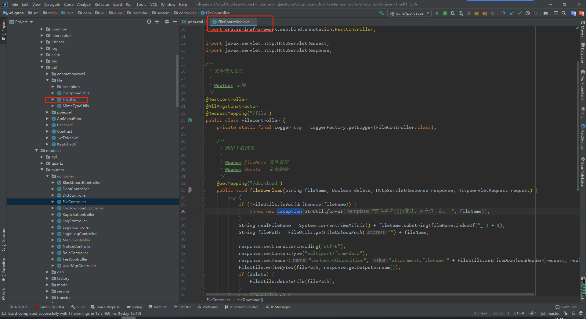
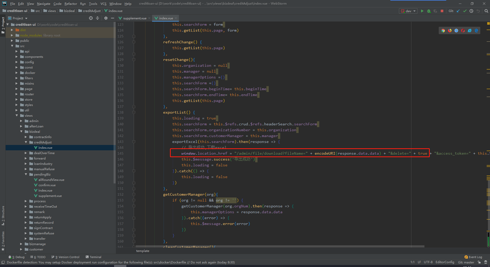
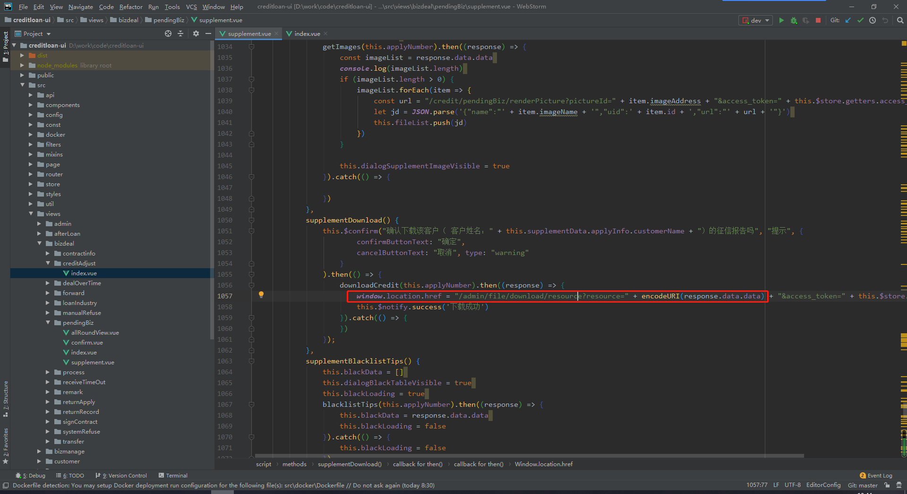

# 简介

具体参考https://github.com/wangliu1102/wl-guns，

工具包在com.wl.guns.core.util.file路径下，Controller方法在com.wl.guns.modular.system.controller.FileController

## creditloan、employeehealth中的通知管理都包含了文件上传和下载；

前台使用，调用FileController中的方法路径即可，如下图所示（这是CreditLoan信贷项目中的下载文件和导出Excel）：

 