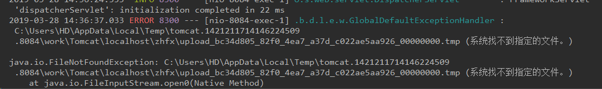
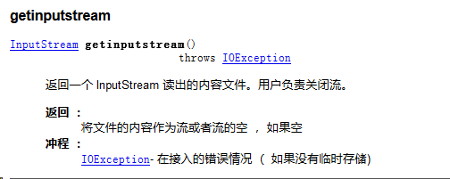

# **springboot项目导入文件出现临时文件目录为空**

最近写文件上传到服务器读取的代码，前端使用FormData上传，服务端用MultipartFile接收，自己测试了下MultipartFile对象有什么东西，结果一般属性都能出来，测试getInputStream()方法的时候出现了以下错误，简单一看这是什么目录，从来没见过啊：



 百度一番之后发现了这是临时文件存放的路径，不清楚根据什么去放在这个目录的，但是这个目录本机的确没有，linux系统下好像系统会10天清空一次，翻阅了API底下有这个



百度的时候也发现另外一个坑，spring配置的MaxInMemorySize配置决定会不会存成临时文件，超过MaxInMemorySize这个大小，则会生成一个临时文件在你的localhost文件夹下。小于这个值，则是存在内存中，不生产临时文件了，所以这个值设置小点，报错也是FileNotFoundException，注意一下

 有网友建议springboot配置tomcat临时文件目录，这个方法没试，我是直接在配置类中加了一个方法，可以参考下：

 

```
/**
 * 指定文件上传的临时目录
 * 如果不指定，linux会定期删除临时目录，导致上传文件失败
 */
@Bean
public MultipartConfigElement multipartConfigElement(){
    MultipartConfigFactory multipartConfigFactory = new MultipartConfigFactory();
    String location = System.getProperty("user.dir") + "/data/tmp";
    File file = new File(location);
    if(!file.exists()){
        file.mkdirs();
    }
    multipartConfigFactory.setLocation(location);
    return multipartConfigFactory.createMultipartConfig();
}
然后debug了下，发现getInputStream()中的path就是我设置的了：
```


或者


在导入文件时，先把文件保存到本地，然后再读取本地文件输入流。

使用MultipartFile.transferTo()方法保存到本地指定目录下，然后使用InputStream input = new FileInputStream(file);获取文件输入流。